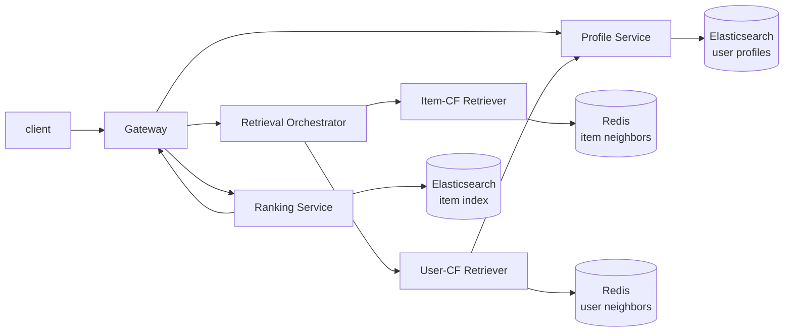

# ShootingStar

Language: English | [Chinese](docs/README.zh-CN.md)

ShootingStar is a production-oriented recommendation engine backend written in C++. It implements the main path of a recommendation system as separate services: user profile, retrieval, retrieval orchestration, ranking, gateway, and offline data processing.

The current feature and data pipeline is built around MovieLens-style data. For local development, services can run from JSONL fixtures. In a Kubernetes deployment, user profiles and item indexes are served from Elasticsearch, while item/user similarity neighbors are served from Redis.

## What It Does

A recommendation request flows through the system like this:



- `Gateway` exposes the external `Recommend` RPC and coordinates profile, retrieval, and ranking calls.
- `Profile Service` loads user profiles from either local JSONL files or Elasticsearch, with an optional local LRU + TTL cache.
- `Retrieval Orchestrator` fans out to multiple retrievers, expands recall size, merges duplicated candidates, and keeps source-level retrieval signals.
- `Item-CF Retriever` uses a user's recent liked, liked, and interested items as trigger seeds, then retrieves similar items.
- `User-CF Retriever` loads similar users, fetches their behavior profiles in batch, and aggregates candidate items from their activity.
- `Ranking Service` currently provides `heuristic_v1`, which scores candidates with retrieval score, interest match, negative feedback, and item quality.
- `tools/offline_data_processing` builds serving data from MovieLens-style CSV files: user profiles, item indexes, item similarity neighbors, and user similarity neighbors.

## Tech Stack

The service side is built with C++23, Bazel / bzlmod, gRPC, Protobuf, and YAML-based runtime configuration.

The storage and infrastructure layer uses Elasticsearch, Redis, libcurl, redis-plus-plus, Docker, and Kubernetes. The repository also includes project-level utilities for HTTP transport, Redis access, resource pooling, LRU caching, JSON / Protobuf data handling, runtime configuration, and structured logging.

The offline pipeline is written in Python. It converts MovieLens-style CSV inputs into JSONL documents or middleware-ready data, then writes profiles and item indexes into Elasticsearch and similarity neighbors into Redis.

## Highlights

The project follows the service boundaries of a real recommendation engine instead of packing the whole flow into one binary.

- Profile, retrieval, ranking, and gateway are independent gRPC services with explicit Protobuf contracts.
- Retrieval keeps both legacy candidate fields and structured `RetrievalSignal` / `RetrievalReason` records, so downstream ranking and debugging can still see why an item was recalled.
- Local JSONL stores and Elasticsearch / Redis stores share the same service-facing interfaces, which makes local debugging lightweight while keeping the deployment path close to the production shape.
- The retrieval orchestrator merges candidates from multiple retrievers. If the same item is recalled by both item-CF and user-CF, its sources and scores are combined instead of silently dropping one path.
- Redis and Elasticsearch access is wrapped with project-level clients for timeout handling, retries, connection pooling, batching, and config-driven setup.
- Offline data processing is split into builders, writers, and jobs, so each stage can be run independently or as an end-to-end data load.

## Repository Layout

```text
protos/recommendation_engine/       gRPC APIs and core data structures
src/recommendation_engine/gateway/  public recommendation entrypoint
src/recommendation_engine/profile/  user profile service
src/recommendation_engine/retrieval/  retrieval orchestration and item/user CF retrievers
src/recommendation_engine/ranking/  ranking service and heuristic_v1 ranker
src/utilities/                      config, logging, HTTP, Redis, cache, and data utilities
tools/offline_data_processing/      offline builders and ES/Redis write jobs
ci_cd/                              Dockerfiles and Kubernetes manifests
```

## Build And Run Locally

The repository is pinned to Bazel 8.4.0. To build the recommendation services:

```bash
bazel build //src/recommendation_engine/...
```

For a local end-to-end run, start the services with their debug configs:

```bash
bazel run //src/recommendation_engine/profile:profile_bin -- \
  --config_path=src/recommendation_engine/profile/config.debug.yaml

bazel run //src/recommendation_engine/retrieval/retrievers/item_cf:retriever_item_cf_bin -- \
  --config_path=src/recommendation_engine/retrieval/retrievers/item_cf/config.debug.yaml

bazel run //src/recommendation_engine/retrieval/retrievers/user_cf:retriever_user_cf_bin -- \
  --config_path=src/recommendation_engine/retrieval/retrievers/user_cf/config.debug.yaml

bazel run //src/recommendation_engine/retrieval/orchestrator:retrieval_orchestrator_bin -- \
  --config_path=src/recommendation_engine/retrieval/orchestrator/config.debug.yaml

bazel run //src/recommendation_engine/ranking:ranking_bin -- \
  --config_path=src/recommendation_engine/ranking/config.debug.yaml

bazel run //src/recommendation_engine/gateway:gateway_bin -- \
  --config_path=src/recommendation_engine/gateway/config.debug.yaml
```

Then send a request through the gateway client:

```bash
bazel run //src/clients:recommendation_engine_client -- -u 300 -m 20
```

`tools/deploy_on_local.py` is also available as a convenience script for starting the local service chain and writing logs under `logs/`.

## Offline Data

Offline processing lives under `tools/offline_data_processing`. The main entrypoints are:

```text
build_profiles_and_write_to_es.sh            build user profiles and write them to Elasticsearch
build_index_and_write_to_es.sh               build item index documents and write them to Elasticsearch
build_item_similarity_and_write_to_redis.sh  build item similarity neighbors and write them to Redis
build_user_similarity_and_write_to_redis.sh  build user similarity neighbors and write them to Redis
```

The item similarity builder uses sharded pair reduction, which keeps large co-occurrence computations from turning into one giant in-memory map.

## Deployment

`ci_cd/` contains service Dockerfiles and Kubernetes manifests. `ci_cd/manifests/local` targets local Kubernetes-style development, while `ci_cd/manifests/k3s` is for a k3s environment.

Recommendation services are deployed into the `recommendation-engine` namespace. Elasticsearch and Redis live in separate namespaces, with credentials injected through Kubernetes Secrets.

Images can be built with `tools/build_images_for_k8s.sh`. The offline write scripts also include temporary port-forward helpers, which makes it practical to load ES/Redis data from a local machine into a cluster.
