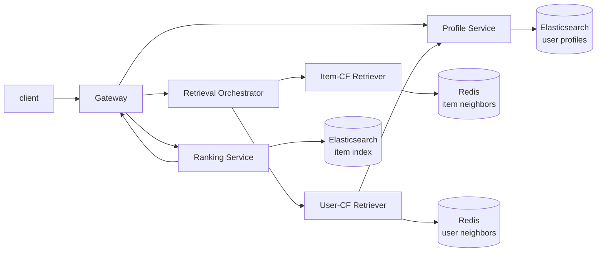

# ShootingStar

语言：[English](../README.md) | 中文

ShootingStar 是一个用 C++ 写的推荐系统后端。它按照生产级推荐引擎的服务拆分方式，实现了用户画像、召回、召回编排、排序、统一入口，以及离线数据处理这几条主线。

当前的数据和特征工程主要围绕 MovieLens 风格的数据展开。本地开发时，服务可以直接读取 JSONL fixture；部署到 Kubernetes 后，用户画像和物料索引由 Elasticsearch 提供，相似 item / 相似 user 邻居由 Redis 提供。

## 实现内容

一次推荐请求大致是这样流过系统的：



- `Gateway` 对外提供 `Recommend` RPC，负责串起画像、召回和排序。
- `Profile Service` 查询用户画像，支持本地 JSONL 和 Elasticsearch 两种 store，并带一层本地 LRU + TTL 缓存。
- `Retrieval Orchestrator` 同时接入多个召回器，对候选做扩量、去重、合并，并保留不同召回来源的信号。
- `Item-CF Retriever` 根据用户近期喜欢、历史喜欢、感兴趣的 item 找相似 item。
- `User-CF Retriever` 先找相似用户，再批量读取这些用户的行为，聚合出候选 item。
- `Ranking Service` 目前实现了 `heuristic_v1`，综合召回分、兴趣匹配、负反馈、物料质量等因素打分。
- `tools/offline_data_processing` 负责把 MovieLens 风格的 CSV 加工成线上服务需要的画像、物料索引、item 相似度和 user 相似度数据。

## 技术栈

服务端主体是 C++23，构建用 Bazel / bzlmod。服务之间通过 gRPC + Protobuf 通信，运行时配置使用 YAML。

中间件和基础设施这块，项目接了 Elasticsearch、Redis、libcurl、redis-plus-plus、Docker 和 Kubernetes。仓库里也写了 HTTP client、Redis client、资源池、LRU cache、JSON / Protobuf 数据处理、运行时配置、结构化日志等通用工具。

离线部分用 Python 写，主要负责把 MovieLens 风格的 CSV 输入转换成 JSONL 文件或可直接写入中间件的数据，再把画像和物料索引写进 Elasticsearch，把相似度邻居写进 Redis。

## 亮点

这个仓库不是把推荐链路塞进一个单体进程里，而是尽量按真实推荐系统的边界拆开。

- 画像、召回、排序和网关都是独立 gRPC 服务，接口由 Protobuf 明确定义。
- 召回结果保留了 `RetrievalSignal` 和 `RetrievalReason`，排序和排查问题时还能看到 item 是从哪一路召回来的。
- 本地 JSONL store 和 ES/Redis store 复用了同一套服务接口，本地调试轻，部署路径也不需要改业务代码。
- 召回编排会合并多路召回结果。同一个 item 同时被 item-CF 和 user-CF 命中时，会合并来源和分数，而不是简单丢掉其中一路。
- Redis / Elasticsearch 访问没有直接散落在业务逻辑里，而是封了一层超时、重试、连接池、批量查询和配置读取。
- 离线数据处理拆成 builder、writer 和 job，既可以单独生成文件，也可以跑完整数据写入流程。

## 目录速览

```text
protos/recommendation_engine/       gRPC API 和核心数据结构
src/recommendation_engine/gateway/  推荐入口服务
src/recommendation_engine/profile/  用户画像服务
src/recommendation_engine/retrieval/  召回编排和 item/user CF 召回器
src/recommendation_engine/ranking/  排序服务和 heuristic_v1 ranker
src/utilities/                      配置、日志、HTTP、Redis、缓存等通用库
tools/offline_data_processing/      离线数据加工和写入 ES/Redis 的工具
ci_cd/                              Dockerfile 和 Kubernetes manifests
```

## 本地构建和运行

项目使用 Bazel 8.4.0。构建推荐服务可以运行：

```bash
bazel build //src/recommendation_engine/...
```

如果想看完整推荐链路的本地版本，可以分别启动这些服务。它们会读取各自的 `config.debug.yaml`：

```bash
bazel run //src/recommendation_engine/profile:profile_bin -- \
  --config_path=src/recommendation_engine/profile/config.debug.yaml

bazel run //src/recommendation_engine/retrieval/retrievers/item_cf:retriever_item_cf_bin -- \
  --config_path=src/recommendation_engine/retrieval/retrievers/item_cf/config.debug.yaml

bazel run //src/recommendation_engine/retrieval/retrievers/user_cf:retriever_user_cf_bin -- \
  --config_path=src/recommendation_engine/retrieval/retrievers/user_cf/config.debug.yaml

bazel run //src/recommendation_engine/retrieval/orchestrator:retrieval_orchestrator_bin -- \
  --config_path=src/recommendation_engine/retrieval/orchestrator/config.debug.yaml

bazel run //src/recommendation_engine/ranking:ranking_bin -- \
  --config_path=src/recommendation_engine/ranking/config.debug.yaml

bazel run //src/recommendation_engine/gateway:gateway_bin -- \
  --config_path=src/recommendation_engine/gateway/config.debug.yaml
```

服务起来后，可以用客户端打一次推荐请求：

```bash
bazel run //src/clients:recommendation_engine_client -- -u 300 -m 20
```

`tools/deploy_on_local.py` 也可以作为一个方便的本地启动脚本使用，它会按顺序拉起服务并把日志写到 `logs/`。

## 离线数据

离线工具放在 `tools/offline_data_processing`。主要入口有：

```text
build_profiles_and_write_to_es.sh            生成用户画像并写入 Elasticsearch
build_index_and_write_to_es.sh               生成物料索引并写入 Elasticsearch
build_item_similarity_and_write_to_redis.sh  生成 item 相似度并写入 Redis
build_user_similarity_and_write_to_redis.sh  生成 user 相似度并写入 Redis
```

item 相似度构建用了分片的 pair-reduction，避免大规模共现计算变成一个巨大的内存 map。

## 部署

`ci_cd/` 里放了服务镜像和 Kubernetes manifests。本地调试可以使用 `ci_cd/manifests/local`，k3s 环境可以看 `ci_cd/manifests/k3s`。

推荐系统相关服务会部署到 `recommendation-engine` namespace。Elasticsearch 和 Redis 分别放在独立 namespace，凭证通过 Kubernetes Secret 注入。

镜像构建脚本在 `tools/build_images_for_k8s.sh`。离线数据写入脚本里也带了临时 port-forward 的逻辑，方便在本机把数据灌进集群里的 ES/Redis。
